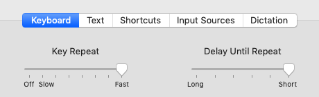
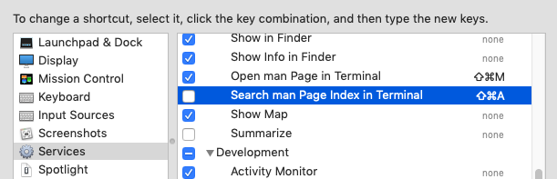
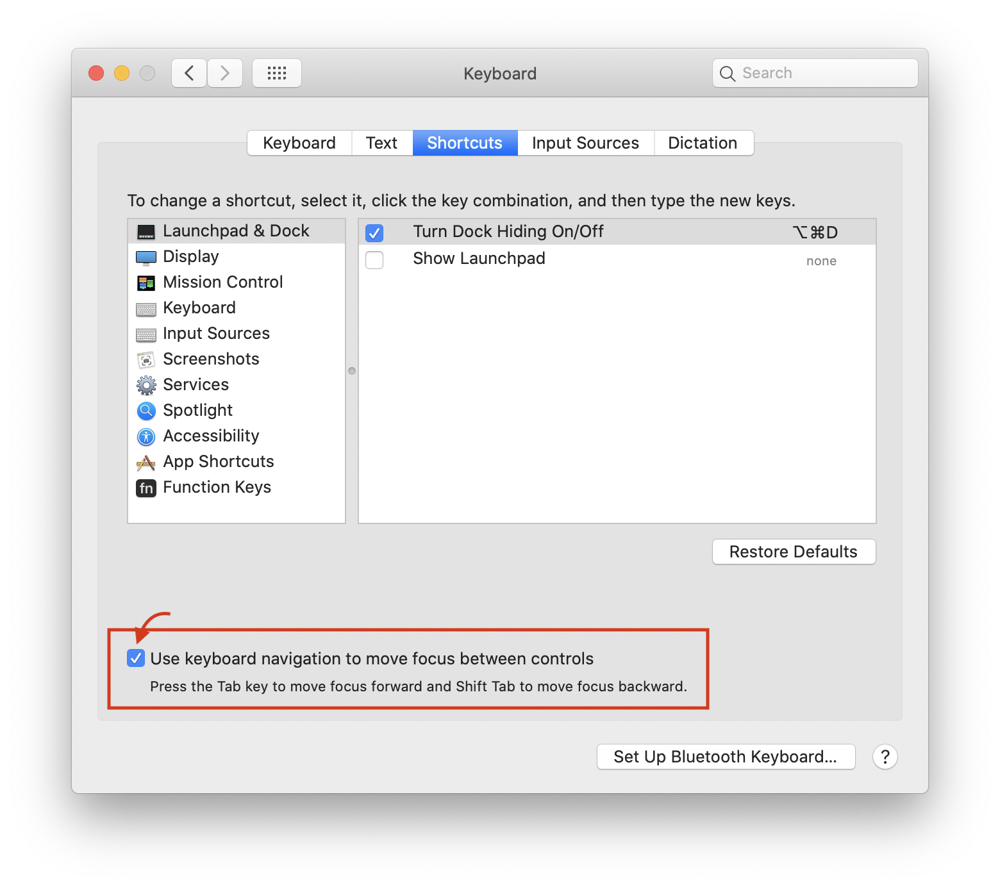
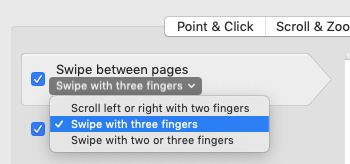

[](https://circleci.com/gh/yasuhiroki/iypymtiycaa)

# iypymtiycaa

This repository is my tips and useful scripts for me.

## Terminal tools/tips

- [iTerm2](https://iterm2.com/)
  - Profiles -> Colors -> Solarize Dark
  - Profiles -> Text -> Font -> Myrica M
- [tmux](https://github.com/tmux/tmux)
- zsh
  - [zplug](https://github.com/zplug/zplug)
  - [zshef](https://github.com/yasuhiroki/zshef)
- [vim](https://github.com/vim/vim)
  - [my vimrc](https://github.com/yasuhiroki/vimrc)
  - [universal-ctags](https://github.com/universal-ctags/ctags)

### Git

- [git](https://github.com/git/git)
- [hub](https://github.com/github/hub)
- [ghq](https://github.com/motemen/ghq)
- [gina.vim](https://github.com/lambdalisue/gina.vim)

### Docker

- docker-compose

### Formetter / Parser

- JSON
  - [jq](https://github.com/stedolan/jq)
  - [gron](https://github.com/tomnomnom/gron) (Make JSON greppable)
  - [jo](https://github.com/jpmens/jo) (Create JSON from CLI)
    - ```bash
      $ jo a=1 b=2
      {"a":1,"b":2}
      ```
- YAML
  - [yq](https://github.com/kislyuk/yq) (extend jq)
- HTML
  - [pup](https://github.com/ericchiang/pup)

## Development tools/tips

- [asdf](https://github.com/asdf-vm/asdf) (language version manager)
  - ruby
  - nodejs
  - elixir (erlang)
  - golang

### API Documentation

- [OpenAPI](https://github.com/OAI/OpenAPI-Specification) (Swagger)
  - Stoplight studio
    - 3rd party app to edit openapi yaml
    - [my sample repository](https://github.com/yasuhiroki/stoplight-studio-sample)
  - with ruby
    - [committee](https://github.com/interagent/committee)
    - [Ruby Kaigi 2019] [How to use OpenAPI3 for API developer](https://rubykaigi.org/2019/presentations/ota42y.html)

## My Macbook configuration

### Keyboard



Off `Search man Page Index in Terminal`, conflict with Android Stduio  


On `Use keyboard navigation to move focus between controls`  


### Tracpad

Swipe with three fingers  


---

> If you put your mind to it, you can accomplish anything.
>> Doc. Brown

